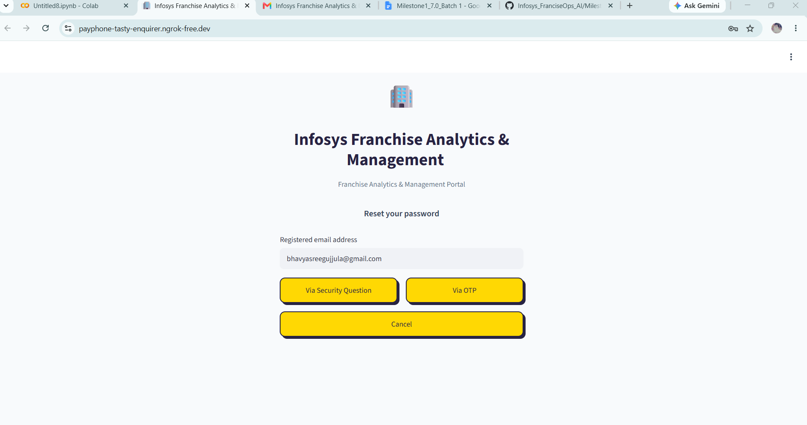
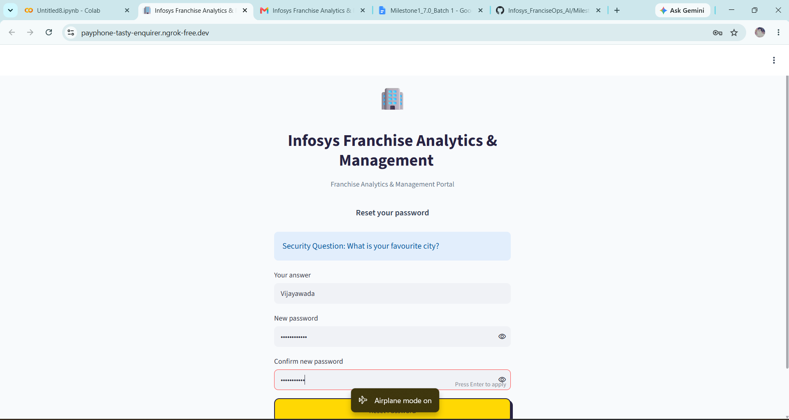
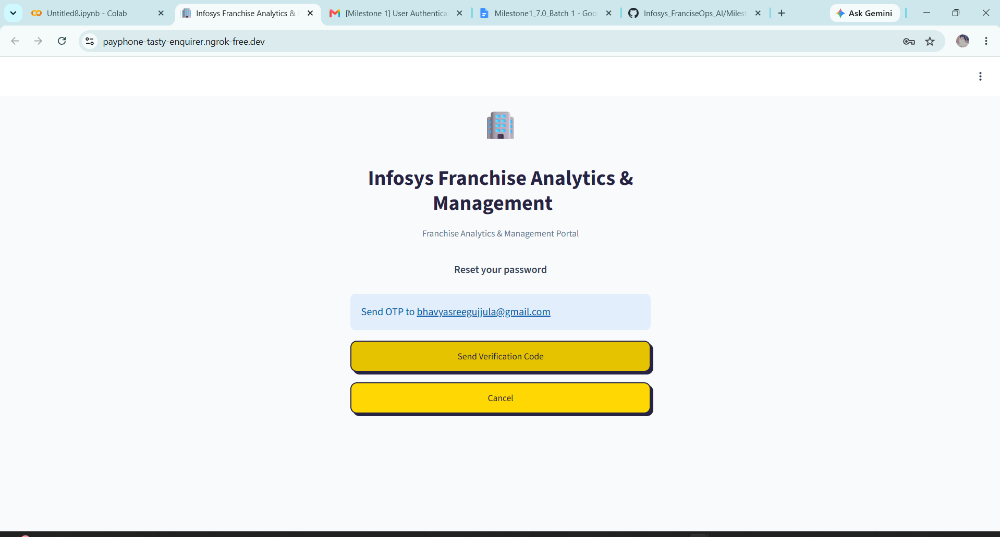
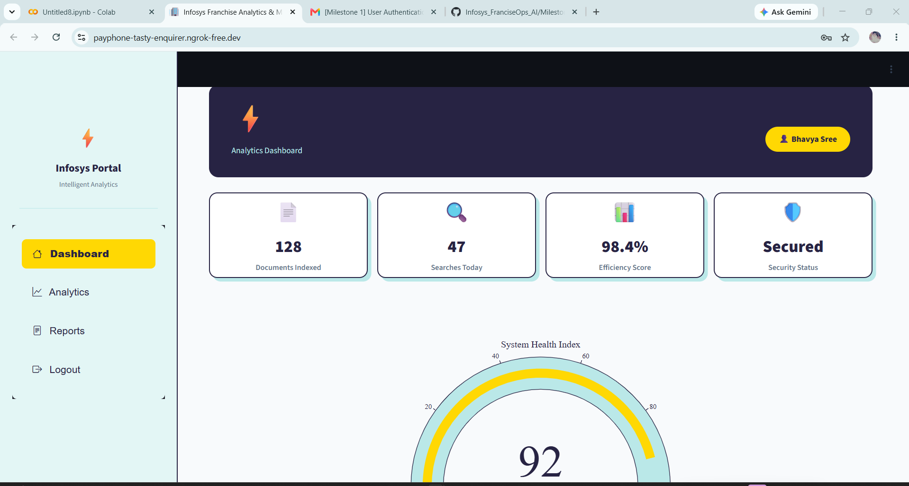
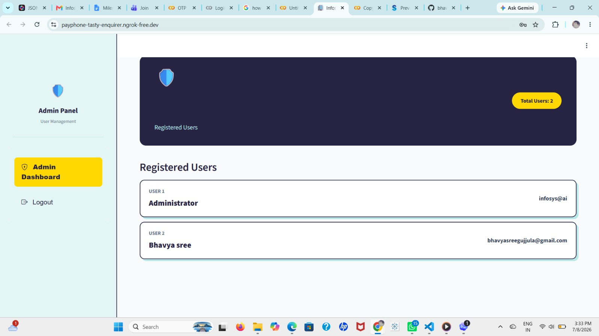

Infosys Franchise Analytics & Management Portal
An enterprise-grade operational dashboard designed to securely track franchise performance KPIs, audit user allocations, and monitor real-time system health parameters. Built using a secure, responsive single-file architecture leveraging Python, Streamlit, and SQLite3.

 Architecture Design & Data Flow
The portal implements an integrated multi-tenant design that isolates structural operational privileges based on authenticated user tokens.

Presentation Tier: A custom-styled Streamlit UI backed by an automated CSS injection engine that manages themes, container transitions, layout depths, and input fields.

Security & Session Middleware: Uses cryptographic hashing via bcrypt for structural credential protection and state tracking via JSON Web Tokens (HS256).

Storage Tier: A relational SQLite3 thread pool that houses database states and handles concurrent credential queries cleanly.

 Complete Environment Setup & Configuration
Follow these instructions to configure environment settings and spin up the production cluster.

1. Prerequisites & Dependencies
Ensure your development workstation runs Python 3.10 or newer. Install all mandatory packages via pip:

Bash
pip install streamlit streamlit-option-menu pyngrok pyjwt bcrypt plotly
2. Environment Variables Configuration
The platform relies on system variables to initialize the automated SMTP email engine safely. Define your variables based on your operating environment:

Linux / macOS:

Bash
export EMAIL_PASSWORD="your_gmail_app_password"
Windows (PowerShell):

PowerShell
$env:EMAIL_PASSWORD="your_gmail_app_password"
Google Colab Secrets:
Add a secret parameter named EMAIL_PASSWORD to your notebook's User Data panel.

3. Executing the Local Server Instance
Run the execution script to launch the app locally on port 8501:

Bash
streamlit run app.py --server.port 8501
 Complete Interface Walkthrough
 Authentication Pipelines
User Sign In
The initial portal gateway utilizes real-time string cleansing to safely process incoming email parameters or alphanumeric user handles before passing them to the validation layer.

Secure Account Registration
Enforces password constraints requiring at least 8 characters, an uppercase letter, a lowercase letter, a numeral, and a special character.

 Credential & Account Recovery Infrastructure
If a session token expires or a credential is lost, users can dynamically route themselves through two distinct recovery mechanisms.

Recovery Path A: Hashed Security Questions
Queries the encrypted local database layer directly to match hashed answers against salted user states.

Recovery Path B: Automated Mail Engine OTP
Dispatches an automated, responsive HTML email containing a 6-digit verification pin that automatically decays and invalidates within 5 minutes of creation.

 Application Workspaces
Standard User Analytics Panel
Provides an interactive business intelligence space detailing transaction counts, execution performance metrics, and a dynamic Plotly gauge tracking system health indexes.

Administrative Management Console
Elevated operational portal reserved for administrators, providing a complete structural audit trail of all accounts registered inside the SQLite database.

 Relational Database Schema
The SQLite instance initializes a single users entity table during system boot.

SQL
CREATE TABLE IF NOT EXISTS users (
    id INTEGER PRIMARY KEY AUTOINCREMENT,
    username TEXT UNIQUE,
    email TEXT UNIQUE,
    password_hash TEXT,
    security_question TEXT,
    security_answer_hash TEXT
);
 Security Constraints & Production Notes
Default Administrative Access Keys: Username: admin | Password: Admin@123.

Production Hardening: Ensure these defaults are migrated to runtime secrets prior to deploying the container to public clouds.

Session Lifespans: Active user JWT tokens are hard-coded to decay and expire exactly 2 hours post-issue to mitigate session-hijacking vulnerabilities.

### 🔐 Authentication Flow

#### User Sign In Screen

#### Secure Account Creation

---

### 🛡️ Credential & Account Recovery Pipelines

#### Multi-Option Password Reset Hub

#### Recovery Path A: Security Questions

#### Recovery Path B: Automated Mail Engine OTP

#### OTP Verification Challenge

---

### 📊 Application Workspace

#### Standard User Analytics Dashboard

#### Administrative Management Control Pane

